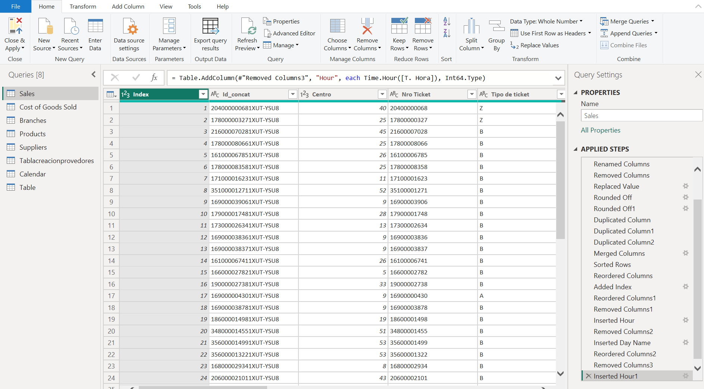

# Power Query

Power Query was used to clean, transform, and enrich the raw sales data before loading it into the analytical model. The transformation process focused on improving data quality, reducing redundancy, and creating a structured dataset optimized for business intelligence reporting.

## Data Preparation
- Renamed tables and columns using business-friendly naming conventions.
- Standardized data types across transactional fields.
- Removed unnecessary columns and duplicate records.
- Rounded numeric values to ensure reporting consistency.
- Created concatenated identifiers to support unique transaction tracking.
- Added derived time attributes to enable hourly sales analysis.
  
## Data Modeling Support
- Created a dedicated Products dimension by extracting unique product information.
- Built a Suppliers dimension with additional business attributes.
- Generated a Calendar table containing date, weekday, month, and week information.
- Reorganized cost data into a dedicated COGS table to improve model structure.
- Relationship Preparation
- Added index columns to establish one-to-one relationships between Sales and COGS tables.
- Removed redundant product attributes from the fact table to avoid data duplication.
- Structured the dataset following a dimensional modeling approach, separating fact and dimension tables.

## Business Enrichment
- Created supplier-product relationships using example-based column generation.
- Added business attributes such as supplier identification, tax information, and location.
- Prepared analytical datasets optimized for profitability, product performance, branch analysis, and scenario simulations.

## Key Applied Steps (Power Query)

Spanish Version

