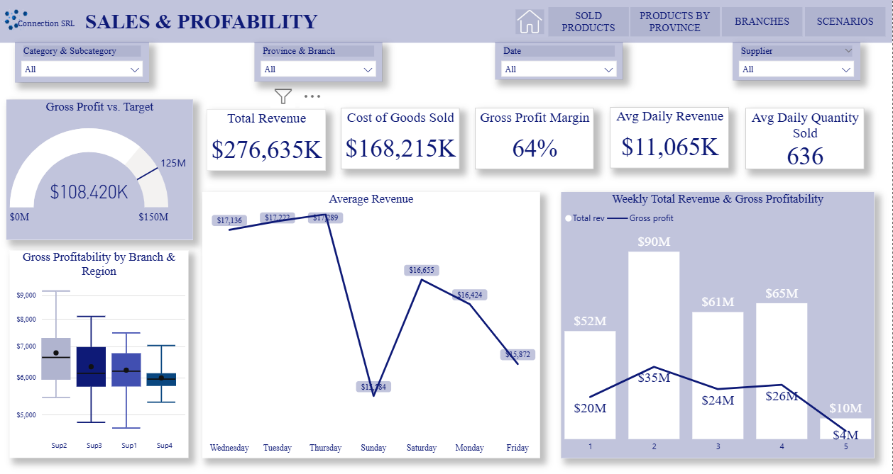
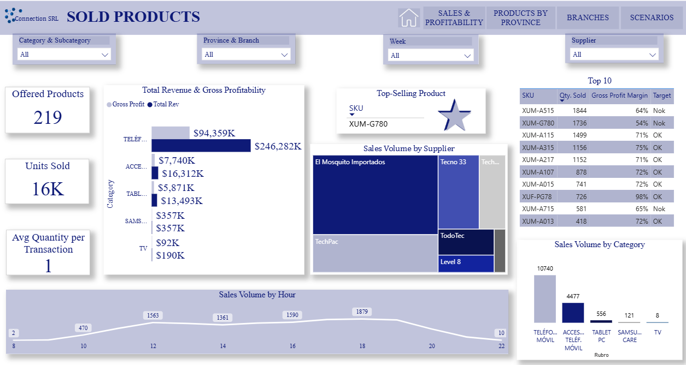
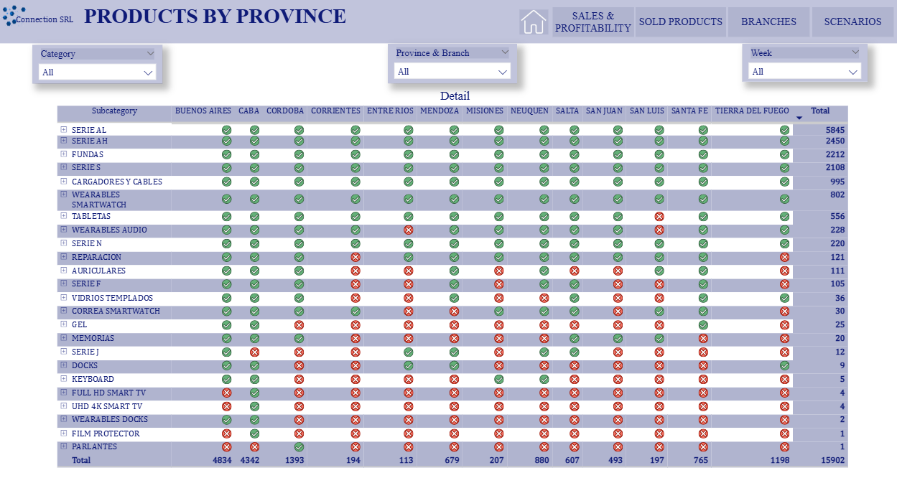
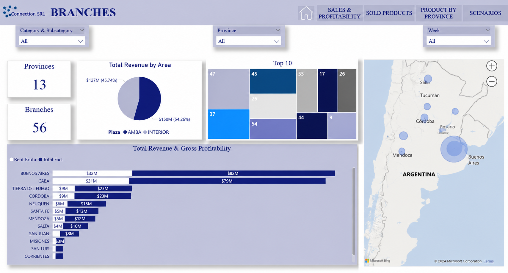
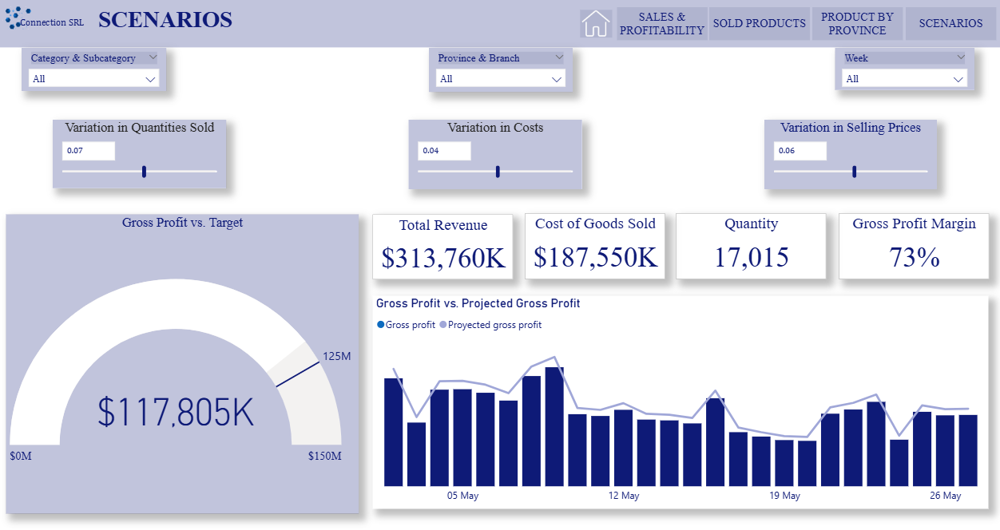

# Retail Sales Performance Analysis
Sales performance and profitability analysis developed using Power BI to support commercial decision-making in a retail environment.

## Context
A mid-sized technology retail company required a comprehensive analysis of its sales performance to better understand revenue generation, cost structure, and profitability drivers across its operations.
The sales department needed a centralized analytical solution to evaluate monthly performance, monitor gross profitability, and identify opportunities for commercial optimization across products, store locations, and regions.
The objective was to transform transactional sales data into actionable insights that could support tactical decision-making related to pricing strategies, product performance, inventory planning, and sales management.
To address this need, an interactive Business Intelligence dashboard was developed in Power BI, enabling stakeholders to analyze key performance indicators through multiple business dimensions such as time, product hierarchy, suppliers, and geographic distribution.

## Objectives
- Valuate overall sales performance and revenue evolution over time.
- Analyze gross profitability to understand margin behavior across products and locations.
- Identify top-performing and underperforming products based on sales volume and profitability.
- Compare performance across regions and store locations to detect operational differences.
- Understand supplier contribution to total revenue and profitability.
- Enable dynamic filtering and exploratory analysis to support data-driven decision-making by business stakeholders.

## Technical Stack

**Power BI**
-Data modeling (star schema design)
-Fact and dimension table architecture
-Relationship management
-Interactive dashboard development
-KPI card design and performance monitoring
-Dynamic slicers and cross-filtering
-Scenario analysis with What-if Parameters

**DAX**
-Measure-driven reporting architecture
-Profitability and margin calculations
-Time-based performance metrics
-Dynamic KPIs and reusable measures
-Scenario simulation measures

**Power Query (M)**
-Data cleaning and normalization
-Data type standardization
-Column transformations and data shaping
-Query merging and calculated fields
-Preparation of analytical datasets

**Business Intelligence & Analytics**
-Sales and profitability analysis
-Product and supplier performance evaluation
-Branch and regional comparison
-Interactive scenario planning
-Data-driven commercial decision support

  

## Notes on Data
The analysis uses a structured retail sales dataset organized under a dimensional data model to support multidimensional performance analysis.

Data Model: Sales fact table containing transaction-level metrics such as revenue, quantity, and cost.
Supporting dimensions including products, suppliers, locations, and calendar data.

Data Preparation: Data was cleaned and transformed using Power Query to ensure consistency, create analytical fields, and validate relationships across tables.

Scope: Profitability analysis focuses on gross profit, as operational expenses were not included in the dataset.

## Screenshots

### Sales & Profitability — Overview
This page provides a comprehensive overview of overall sales performance and gross profitability. It highlights key financial indicators such as total revenue, cost of goods sold, gross profit margin, and average daily performance. The dashboard enables stakeholders to monitor business health, compare profitability across branches and regions, and identify revenue trends over time to support commercial decision-making.

### Products
This page focuses on product performance and sales behavior. It enables users to identify top-performing products, evaluate sales volume and profitability by category, analyze supplier contribution, and understand purchasing patterns throughout the day. The dashboard supports product strategy, pricing decisions, and sales optimization initiatives.

### Products by Province
This page provides a geographical view of product demand across provinces. It helps identify regional sales patterns, detect products with low or no sales activity, and support inventory distribution and commercial planning decisions. The analysis allows stakeholders to better understand market demand at a local level.

### Branches
This page analyzes branch performance across the organization. Users can compare revenue and profitability by province, identify top-performing locations, and evaluate the company's regional footprint. The dashboard supports operational and commercial decision-making by highlighting differences in performance across branches and geographic areas.

### Scenarios
This page enables scenario analysis by simulating changes in sales volume, product costs, and selling prices. Users can evaluate the potential impact of different business assumptions on revenue and profitability, supporting planning activities and strategic decision-making through interactive what-if analysis.

## Key Insights & Recommendations
This analysis provides a clear view of sales performance and profitability across products, branches, and regions, supporting data-driven commercial decisions.

### Key Insights
Sales and gross profit are concentrated in a few branches and provinces.
Product profitability varies significantly, revealing opportunities to optimize the product portfolio.
Scenario analysis highlights the impact of cost, pricing, and sales volume changes on business performance.

### Business Recommendations
Focus commercial efforts on high-performing markets while improving underperforming branches.
Prioritize high-margin products and continuously monitor pricing and supplier costs.
Expand the data model with historical information to enable trend analysis and future forecasting.
